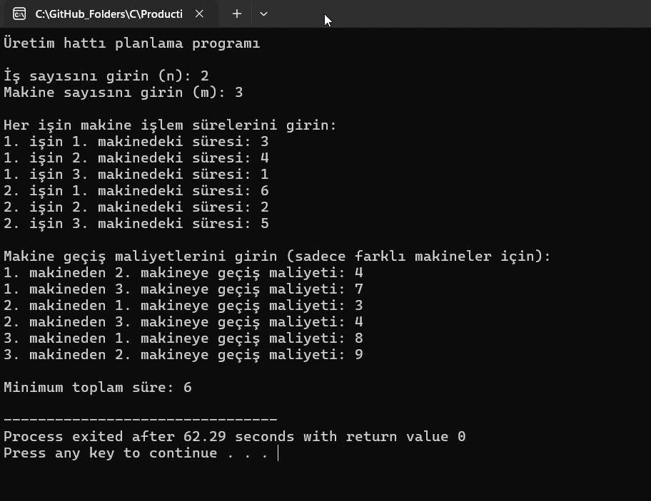

# Üretim Hattı Planlama Programı

Bu proje, dinamik programlama kullanarak bir üretim hattındaki işleri minimum toplam süreyle tamamlamak için geliştirilmiştir. Projede, her işin her makinedeki tamamlanma süresi ve makineler arası geçiş maliyetleri göz önüne bulundurularak, tüm işler sırayla tamamlanacak şekilde planlanmaktadır.

## Problem Tanımı

Bir üretim hattında, `n` adet iş (örneğin, bir ürünün parçalarının işlenmesi) sırayla tamamlanmalıdır. Bu işler, `m` farklı makinede yapılabilir. Her işin her makinedeki tamamlanma süresi farklıdır ve makineler arasında geçiş yapılması durumunda bir geçiş maliyeti (örneğin, makine ayar süresi veya taşıma maliyeti) ortaya çıkar. Buradaki amaç, tüm işleri sırayla tamamlamak için **minimum toplam süreyi** bulmaktır. Toplam süre, işlerin tamamlanma süreleri ve makineler arası geçiş maliyetlerinin toplamıdır.

## Matris Zinciri Çarpımı İle İlişkisi

Bu problem, matris zinciri çarpımı problemine benzer şekilde dinamik programlama yaklaşımıyla çözülür. Her işin ve makinenin belirli bir sıralamada yer alması gerektiğinden, en uygun çözüm için adım adım seçim yapılır. Bu tür bir problemde, geçişlerin ve sürelerin hesaplanmasında kullanılan dinamik programlama yöntemi, alt problemleri çözerek ana probleme yaklaşır.

## Tablolama ve Hafızalama Algoritmaları

### Tablolama (Bottom-Up Approach)
Bu yöntem, küçük alt problemlerin çözülmesini sağlayarak tüm problemi çözmek için kullanılır. Her adımda, önceki adımlardan elde edilen sonuçlar kullanılarak çözüm genişletilir.

### Hafızalama (Top-Down Approach)
Bu yöntemde, çözüm süreci sırasında her alt problem yalnızca bir kez hesaplanır ve sonuçlar hafızada saklanarak tekrar hesaplamaların önüne geçilir.

## Adım Adım Uygulanan Algoritmaların Açıklamaları

### 1. İşlerin Sıralanması
İlk adımda, her işin her makinedeki işlem süresi ve geçiş maliyetleri göz önüne alınarak, hangi makinelerde hangi işlerin yapılacağı belirlenir.

### 2. Geçiş Maliyetlerinin Hesaplanması
Makine değişimi durumunda ortaya çıkan geçiş maliyetleri hesaplanır ve toplam süreyi minimize etmek için bu maliyetler göz önünde bulundurulur.

### 3. Kod Açıklamaları

Kod, dinamik programlama ile en düşük toplam süreyi hesaplamak için aşağıdaki adımları izler:

- **Girdi Alma**: Kullanıcıdan iş sayısı, makine sayısı, her işin her makinedeki işlem süresi ve makineler arası geçiş maliyetleri alınır.
- **Dinamik Programlama Tablosu Oluşturma**: Her işin her makineye ait maliyetini depolayan bir dinamik programlama tablosu (`dp`) oluşturulur. Bu tablo, önceki işlerin çözümünü kullanarak her işin çözümünü adım adım hesaplar.
- **Geçiş Maliyetlerinin Hesaplanması**: Dinamik programlama tablosunda, bir işten diğerine geçerken kullanılan geçiş maliyetleri ve her işin tamamlanma süreleri dikkate alınarak toplam süre hesaplanır.
- **Sonuç Hesaplama**: Son işin tamamlanması için minimum toplam süre, dinamik programlama tablosundaki sonuçlardan seçilir.

## Örnek Çıktı

